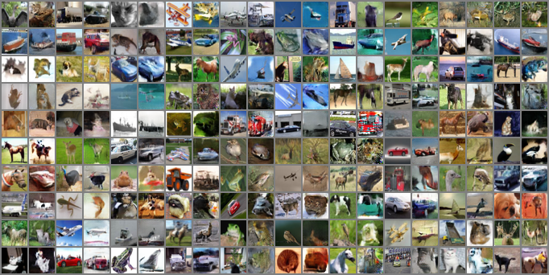

# Adversarially Learned Inference

ALI implementation in PyTorch 1.2.

This code implements the ideas presented in the paper [Adversarially Learned Inference (Dumoulin et al)][2].

**NOTE**: This implementation also makes use of [`pylego`][1], which is a minimal library to write easily extendable experimental machine learning code.

## Results

Reconstructions from a model trained with CIFAR10:

Samples from a model trained with CIFAR10:

[1]: https://github.com/ankitkv/pylego
[2]: https://arxiv.org/abs/1606.00704
